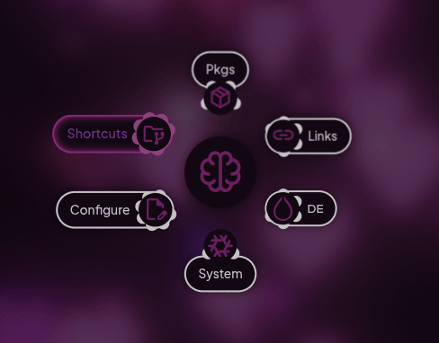

<!--
 here is a basic multiline comment for formatting reference o7
-->

<!--
<p align="center">
  
</p>


-->

<h1 align="center">Pywal Kando Theme</h1>

<p align="center">
  Pywal theme for <a href="https://kando.menu/">Kando</a>. (The cross-platform pie menu)<br>
  All code is licensed under the <a href="LICENSE">Unlicense License</a>. (Do whatever u want idc)
</p>

<p align="center">
  
</p>

## Repository Structure
```
pywal-kando-theme/
├── md-assets/ ----------------------------- Images and other markdown/README assets
|  ├── pywal-kando-preview.gif ------------- Preview (uncropped)
|  └── pywal-kando-preview-cropped.gif ----- Preview (cropped)
├── install.sh ----------------------------- Install script for pywal-to-kando.sh
├── LICENSE -------------------------------- License for the repo
└── README.md ------------------------------ Main README for the repo
```

## Installation
> [!NOTE]
> The actual script used here is held within \
> [my bash scripts repository](https://github.com/0lswitcher/bash-scripts), and you can
> find it under `pywal-to-kando.sh`. \
> Feel free to take a look at it there to see the actual source code instead of the lil `install.sh` I have here. 

There are two methods for installing this script;
> - cURL and run the install script (which automatates the following method)
> 
*OR:*

> - git clone this repo
> - move `nether-labels` theme to Kando's `menu-themes` dir
> - delete the now un-needed repo
> - cURL the source script from [my bash scripts repository](https://github.com/0lswitcher/bash-scripts), and make it executable

Either method is viable, and the choice is a matter of preference.

<details open>
<summary><b>Click here</b> for Method 1...</summary>

## Method 1: *(Easy, high trust)*

<blockquote>
<b>WARNING:</b>

Always check the contents of a script before running it! 

I obviously have nothing malicious in mine, but many bad actors are \
copying entire repositories, and swapping innocent install scripts for malicious ones.

I avoid writing install scripts for this reason, but this repo specifically called for one due to the level of installation steps.

Don't let yourself fall victim to a dumb ass virus because you were in a rush. \
Please be a good web-citizen and report any fake repositories you see. Thanks!
> If you want a quick further read on it: [Millions of Malicious Repositories Flood Github (Article)](https://www.darkreading.com/application-security/millions-of-malicious-repositories-flood-github)
</blockquote>

Run the script:
```
curl -fsSL https://raw.githubusercontent.com/0lswitcher/pywal-kando-theme/refs/heads/main/install.sh | bash
```
That's it!

> By default, the `install.sh` script places `pywal-to-kando.sh` in `~/.local/bin/`. \
> Feel free to move it to another directory of your choosing!

</details>
<br>

<!---------------------------------------------------------------------------------------------------------->

<details>
<summary><b>Click here</b> for Method 2...</summary>

## Method 2: *(More involved, low trust)*

Clone the git repo:
```
git clone https://github.com/0lswitcher/pywal-kando-theme.git
```

Move the `nether-labels` theme folder to your Kando's `menu-themes` directory:
```
mv ./nether-labels ~/.config/kando/menu-themes/
```
Or alternatively, if you installed Kando with Flatpak:
```
mv ./nether-labels ~/.var/app/menu.kando.Kando/config/kando/menu-themes/
```

Next, delete the now un-needed repository:
```
rm -R ./pywal-kando-theme
```

Download the script:
```
curl -sLO https://raw.githubusercontent.com/0lswitcher/bash-scripts/refs/heads/main/scripts/pywal-to-kando.sh
```
Then, make it executable:
```
chmod +x ./pywal-to-kando.sh
```
That's it! \
Now, you can move it to another directory of your choosing:
```
mv ./pywal-to-kando.sh ~/.local/bin/
```
> Feel free to replace `~/.local/bin/` with whatever you prefer.

</details>


## Usage
Usage is simple, and I've written the script to be compatable with as many distro's and WM's possible. 

It should be ready to go out the box, with no configuration required.

The script can be ran with:
```
bash /path/to/pywal-to-kando.sh
```
> Make sure to replace `/path/to/` with the correct path to your script location.

<br>

> [!TIP] 
> To enable the theme in Kando, simply navigate to your Kando settings, select the **"Menu Themes"** tab (the palette icon), \
> pick the **"Nether Labels"** theme, and then in the **"Accent Colors"** section, select **"Pywal"**.

> [!NOTE]
> I personally have `pywal-to-kando.sh` referenced in a wrapper script that runs on theme change.
> 
> I have some additional notes about my usage [here](https://github.com/0lswitcher/bash-scripts/tree/main#pywal-wrapper), and you can \
> also see the source code for my `pywal-wrapper.sh` script [here](https://github.com/0lswitcher/bash-scripts/blob/main/scripts/pywal-wrapper.sh).

## Credits
This theme is a modified version of the [Nether Labels](https://github.com/kando-menu/menu-themes/tree/main/themes/nether-labels) theme by [elfi-ox](https://github.com/elfi-ox), \
which itself is a modified version of the [Rainbow Labels](https://github.com/kando-menu/kando/tree/main/assets/menu-themes/rainbow-labels) by [Simon Schneegans](https://github.com/Schneegans).

## License
This repository is licensed under the [Unlicense License](LICENSE). (do whatever u want idc)

## Contributing
1. Fork the repo  
2. Create a branch for your feature/fix  
3. Submit a pull request  

---

<p align="center">
  <sub>made with ❤️ by 0lswitcher</sub>
</p>
